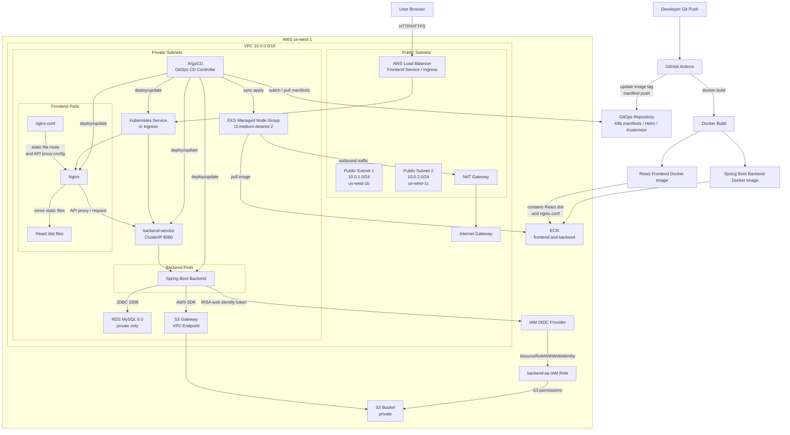
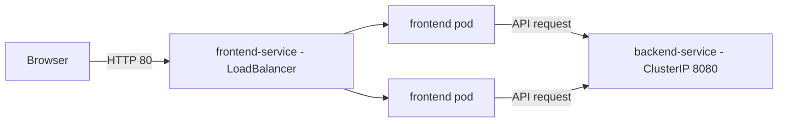
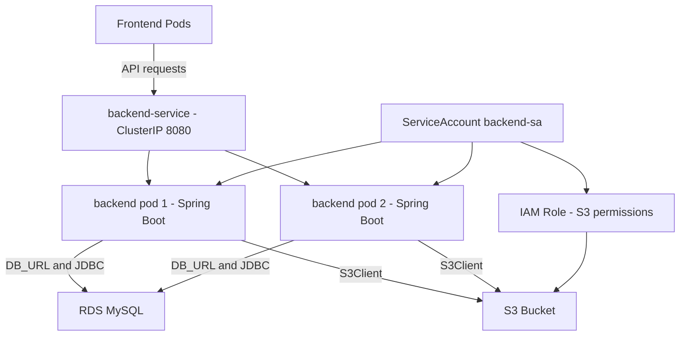
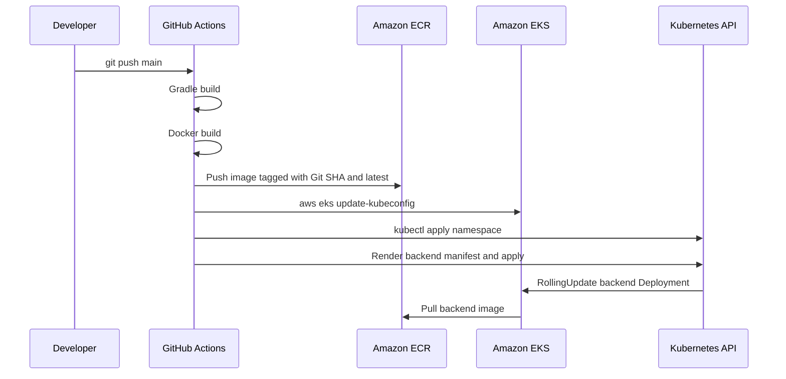

# AWS EKS Backend Application

Spring Boot 기반 백엔드 애플리케이션입니다. EKS 내부에서 `backend-service`라는 ClusterIP Service로 실행되며, 프론트엔드 API 호출 처리, S3 파일 업로드/미리보기, RDS MySQL 연결을 담당합니다.

이 README는 백엔드 애플리케이션, Kubernetes 배포 리소스, AWS 인프라 연결 구조, GitHub Actions 배포 흐름을 한 번에 파악할 수 있도록 구성되어 있습니다.

## 기술 스택

- Java 17
- Spring Boot 3.2.5
- Spring Web
- Spring Data JPA
- MySQL Connector/J
- AWS SDK for Java v2 S3
- Docker
- Kubernetes/EKS
- GitHub Actions
- Terraform
- ArgoCD

## 전체 아키텍처

사용자 트래픽은 프론트엔드 LoadBalancer를 통해 EKS로 들어오고, 프론트엔드 Pod는 내부 ClusterIP Service인 `backend-service`로 API 요청을 전달합니다. 백엔드 Pod는 RDS MySQL과 S3를 사용하며, S3 접근 권한은 ServiceAccount 기반 IRSA로 주입됩니다.




## AWS 인프라 구성

| 리소스 | 이름/구성 | 역할 |
| --- | --- | --- |
| VPC | `sample-app-vpc`, `10.0.0.0/16` | 전체 네트워크 경계 |
| Public subnets | `10.0.1.0/24`, `10.0.2.0/24` | 외부 진입 LoadBalancer, NAT Gateway |
| Private subnets | `10.0.10.0/24`, `10.0.20.0/24` | EKS nodes, application pods, RDS |
| EKS | `sample-app-eks` | Kubernetes cluster |
| Node group | `sample-app-node-group` | private subnet의 worker nodes |
| ECR backend | `sample-app/backend` | 백엔드 컨테이너 이미지 저장소 |
| ECR frontend | `sample-app/frontend` | 프론트엔드 컨테이너 이미지 저장소 |
| RDS | `sample-app-mysql`, MySQL 8.0 | 애플리케이션 DB |
| S3 | `sample-app-dev-files-<account-id>-mj` | 업로드 파일 저장소 |
| IAM OIDC | EKS OIDC provider | IRSA 연동 |
| IAM Role | `sample-app-backend-sa-role` | 백엔드 Pod의 S3 접근 권한 |

### 서브넷 구조

```text
AWS Region: us-west-1

VPC 10.0.0.0/16
├─ Public Subnet 1  10.0.1.0/24   us-west-1b
│  ├─ Internet Gateway route
│  ├─ NAT Gateway
│  └─ Frontend LoadBalancer entry point
├─ Public Subnet 2  10.0.2.0/24   us-west-1c
│  └─ Internet Gateway route
├─ Private Subnet 1 10.0.10.0/24  us-west-1b
│  ├─ EKS managed node group
│  ├─ Frontend pods
│  ├─ Backend pods
│  └─ RDS subnet group
└─ Private Subnet 2 10.0.20.0/24  us-west-1c
   ├─ EKS managed node group
   ├─ Frontend pods
   ├─ Backend pods
   └─ RDS subnet group

External services
├─ ECR: backend/frontend container images
├─ S3: uploaded files
├─ IAM/OIDC: IRSA for backend S3 access
└─ GitHub Actions: CI/CD runner
```

| 구분 | CIDR | AZ | 주요 배치 | 외부 통신 |
| --- | --- | --- | --- | --- |
| Public subnet 1 | `10.0.1.0/24` | `us-west-1b` | NAT Gateway, LoadBalancer 진입점 | Internet Gateway |
| Public subnet 2 | `10.0.2.0/24` | `us-west-1c` | LoadBalancer 가용 영역 | Internet Gateway |
| Private subnet 1 | `10.0.10.0/24` | `us-west-1b` | EKS nodes, pods, RDS subnet group | NAT Gateway |
| Private subnet 2 | `10.0.20.0/24` | `us-west-1c` | EKS nodes, pods, RDS subnet group | NAT Gateway |

EKS managed node group과 애플리케이션 Pod는 private subnet에 배치됩니다. RDS는 public 접근이 차단된 private DB로 구성되며, private subnet CIDR에서 MySQL `3306` 접근만 허용합니다.

## 애플리케이션 구성

### 프론트엔드

프론트엔드는 별도 repository인 `sample-app/front`에서 관리됩니다.

| 항목 | 값 |
| --- | --- |
| Kubernetes `Deployment` | `frontend` |
| Kubernetes `Service` | `frontend-service` |
| Service type | `LoadBalancer` |
| Container port | `80` |
| Replicas | `2` |
| 배포 이미지 | `${FRONTEND_IMAGE}` |

프론트엔드는 외부 사용자의 진입점입니다. EKS에서 `LoadBalancer` 타입 Service로 노출되며, AWS Load Balancer를 통해 브라우저 트래픽을 받습니다.



### 백엔드

백엔드는 이 repository에서 관리됩니다.

| 항목 | 값 |
| --- | --- |
| Kubernetes `ServiceAccount` | `backend-sa` |
| Kubernetes `Secret` | `backend-secret` |
| Kubernetes `Deployment` | `backend` |
| Kubernetes `Service` | `backend-service` |
| Service type | `ClusterIP` |
| Container port | `8080` |
| Replicas | `2` |
| 배포 이미지 | `${BACKEND_IMAGE}` |

백엔드는 외부에 직접 노출되지 않습니다. 프론트엔드 또는 클러스터 내부 워크로드만 `backend-service.sample-app.svc.cluster.local:8080` 주소로 접근합니다.



### 백엔드 통신 흐름

```text
User Browser
  |
  | HTTP
  v
Frontend Service (EKS LoadBalancer)
  |
  | Kubernetes Service routing
  v
Frontend Pods
  |
  | /api/* request
  v
Backend Service: backend-service.sample-app.svc.cluster.local:8080
  |
  | Kubernetes Service routing
  v
Backend Pods (Spring Boot)
  |                         |
  | JDBC                    | AWS SDK for Java v2
  v                         v
RDS MySQL (private subnet)  S3 Bucket
```

## API

| Method | Path | 설명 |
| --- | --- | --- |
| `GET` | `/health` | Kubernetes readiness/liveness probe |
| `GET` | `/api/hello` | 백엔드 연결 확인 |
| `POST` | `/api/upload` | multipart 파일을 S3에 업로드 |
| `GET` | `/api/preview/{fileName}` | S3 객체를 스트리밍 방식으로 미리보기 |

## 배포 흐름

현재 백엔드 배포는 GitHub Actions의 `.github/workflows/deploy-eks.yml`에서 수행합니다.



1. `main` 브랜치 push 또는 수동 실행으로 workflow가 시작됩니다.
2. Gradle로 jar를 빌드합니다.
3. Docker 이미지를 빌드하고 ECR에 `${github.sha}`와 `latest` 태그로 push합니다.
4. EKS kubeconfig를 갱신합니다.
5. `k8s/namespace.yaml`을 적용합니다.
6. `k8s/backend.yaml`을 환경변수로 렌더링한 뒤 Kubernetes에 적용합니다.
7. `deployment/backend` rollout 완료를 기다립니다.

## 환경 변수와 Secrets

### 애플리케이션 환경 변수

`src/main/resources/application.yml`은 `.env` 파일을 선택적으로 import합니다. 로컬 실행에서는 `.env`를 사용할 수 있고, EKS 배포에서는 Kubernetes Secret과 GitHub Actions Secrets를 통해 값이 주입됩니다.

```env
AWS_REGION=us-west-1

DB_URL=jdbc:mysql://<rds-endpoint>:3306/mydb?serverTimezone=Asia/Seoul&characterEncoding=UTF-8
DB_USERNAME=<db-username>
DB_PASSWORD=<db-password>

S3_BUCKET_NAME=<s3-bucket-name>
BACKEND_IMAGE=<ecr-backend-image>
BACKEND_SA_ROLE_ARN=<backend-service-account-role-arn>
```

`DB_URL`은 반드시 `jdbc:mysql://`로 시작해야 합니다. `mysql://` 형식은 Spring JDBC URL로 인식되지 않습니다.

### EKS 배포 변수

| 변수 | 사용처 | 값 출처 |
| --- | --- | --- |
| `BACKEND_IMAGE` | Deployment image | ECR 이미지 URI + Git SHA |
| `BACKEND_SA_ROLE_ARN` | ServiceAccount IRSA annotation | Terraform output |
| `AWS_REGION` | 애플리케이션/S3 region | GitHub Actions variable |
| `DB_URL` | Spring datasource URL | `terraform output -raw rds_db_url` |
| `DB_USERNAME` | Spring datasource username | Terraform DB username |
| `DB_PASSWORD` | Spring datasource password | Terraform DB password |
| `S3_BUCKET_NAME` | S3 bucket 설정 | `terraform output -raw s3_bucket_name` |

### GitHub Actions Secrets

백엔드 repository에는 다음 Secrets가 필요합니다.

```text
AWS_ACCESS_KEY_ID
AWS_SECRET_ACCESS_KEY
ECR_BACKEND_URI
EKS_CLUSTER_NAME
BACKEND_SA_ROLE_ARN
DB_URL
DB_USERNAME
DB_PASSWORD
S3_BUCKET_NAME
```

`AWS_REGION`은 repository variable로 설정할 수 있습니다. 설정하지 않으면 workflow 기본값인 `us-west-1`을 사용합니다.

## 로컬 실행

```bash
./gradlew clean build -x test
./gradlew bootRun
```

Windows PowerShell에서는 다음처럼 실행할 수 있습니다.

```powershell
.\gradlew.bat clean build -x test
.\gradlew.bat bootRun
```

로컬에서 RDS에 직접 접속하려면 네트워크 경로와 보안 그룹이 허용되어 있어야 합니다. RDS가 private subnet에만 있으면 로컬 PC에서 직접 접속되지 않을 수 있습니다.

## Docker 빌드

```bash
./gradlew clean build -x test
docker build -t sample-app-backend:local .
docker run --env-file .env -p 8080:8080 sample-app-backend:local
```

## 운영 확인 명령

```bash
kubectl get all -n sample-app
kubectl get pods -n sample-app -l app=backend
kubectl logs -n sample-app -l app=backend --tail=100
kubectl describe pod -n sample-app -l app=backend
kubectl rollout status deployment/backend -n sample-app
```

서비스 내부 DNS:

```text
backend-service.sample-app.svc.cluster.local:8080
```
